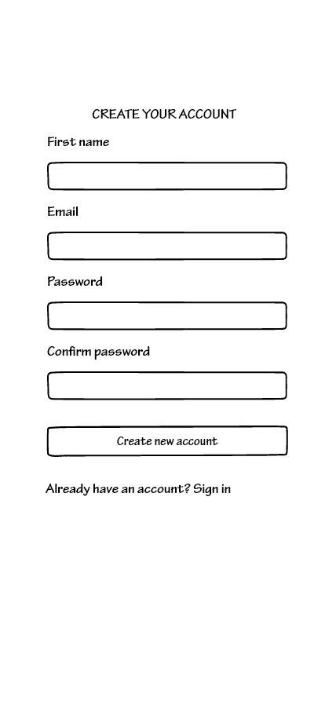
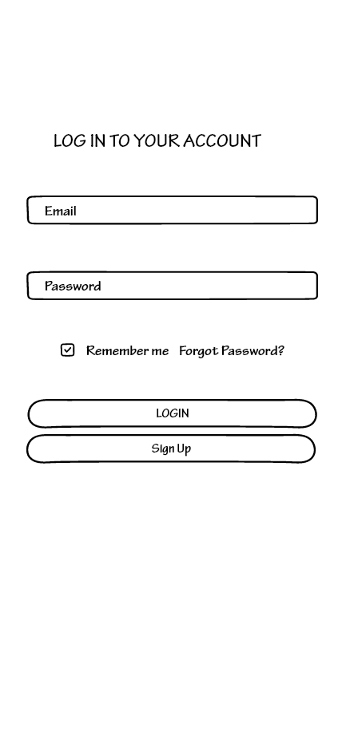
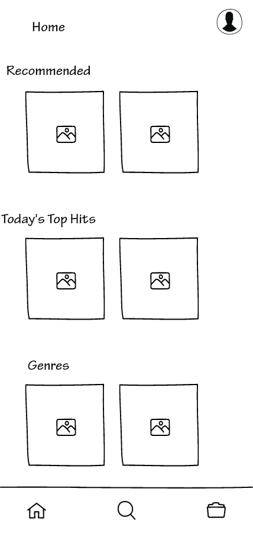
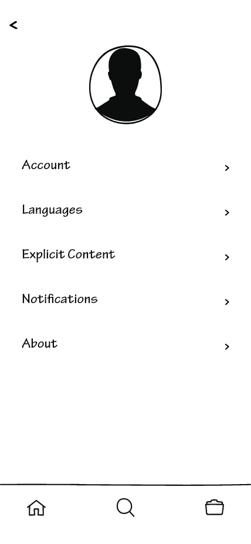
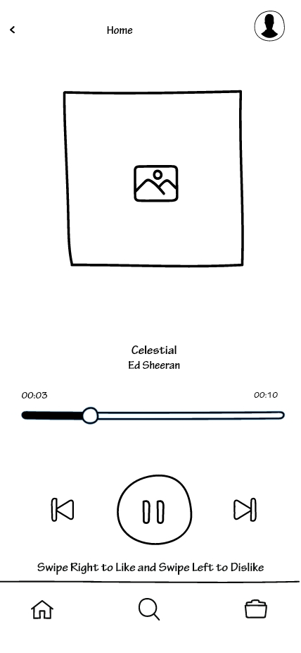
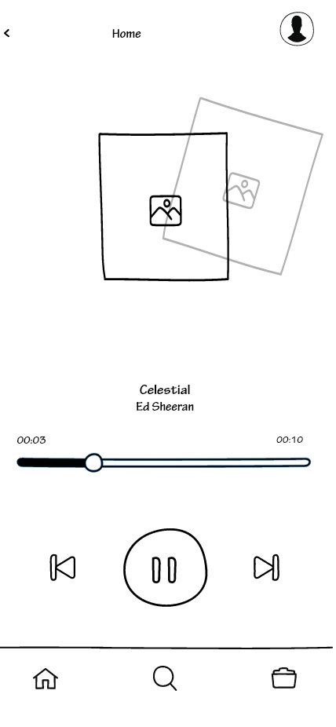
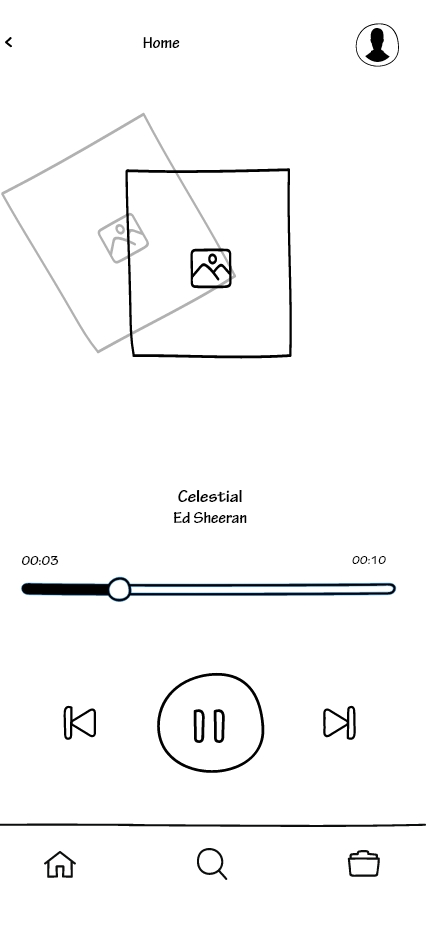
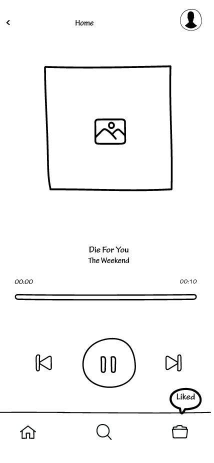
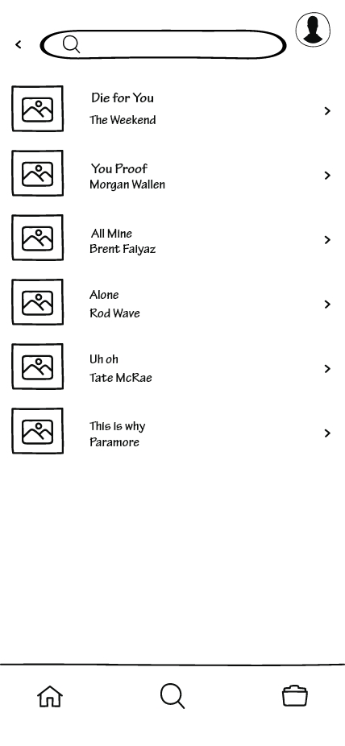

# Wireframes

*Figure 1: The login and Sign-up forms*

When first logging into the application, users will be prompted to first login to their account or sign up for an account. The sign up process is as follows. Users will first enter their name, then their email address. Next, users will set up a password and then be prompted to enter it again to confirm. After completing the login or sign up process, users will be able to access their account and all of its features. 

*Figure 2: Homepage and Account Information*

In the first image, we have the main homepage. This is where users are able to browse for music within genres they want to listen to. There is a recommended playlist image that when tapped on will display all types of music that Song Snippet will think that you may be interested in. When tapping on any of the genre images, it will bring up snippets only in that genre that Song Snippet thinks you would like to listen to. Next, when tapping on the profile icon in the top-right hand corner, it will bring up the Account Information page. This page will display your profile information such as your profile image, account information, the display language, filter explicit content, enable or disable notifications, and the about page. On the bottom of the screen, you will notice a navigation bar that displays three different icons. The first icon takes you to the homepage as indicated by the house icon. The second icon in the middle is the search feature, that allows you to look up specific music that you want to listen to. The final icon on the right hand side is the playlist/liked songs icon. This icon will send you to a personal page where it displays custom playlists of songs that you have created and all of the liked songs that you have favorited. 

*Figure 3: Finding songs, Liking/Disliking, and Adding to Library*

After tapping on one of the icons to search for songs, it will bring you to this page. Here it will display the song that is currently playing, the name of the song, the artist, the length of the snippet, a back button to go back to the previous song, a pause/play button, and a forward button to skip to the next song. Below this is a prompt that tells you that the image is swipeable indicating how to dislike and like a song. This message is designed to leave after a short time has passed. This clears up any confusion for the user on how to like or dislike songs. The second and third images show users swiping on the screen to indicate that they are liking or disliking the current song. The fourth image shows that if a user has decided to like a song, that song will be added to their library. The little icon above the library icon will appear notifying the user that the song has been successfully added to their library. When disliking a song, the next song will play with no added icon. 

*Figure 4: Search*

After tapping on the search icon, users will be able to find any specific songs they want to look up and listen to. It features a search bar on the top of the screen as well as a history of search below it indicating previous songs users have looked up. 
